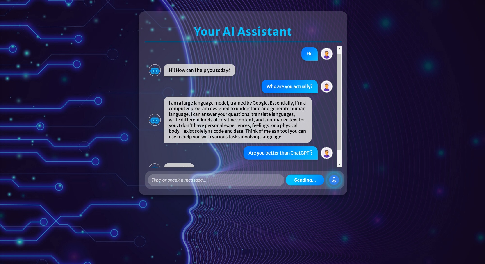

# Your AI Assistant 🤖  

  

Your AI Assistant is an interactive chatbot application built with Flask (backend) and JavaScript (frontend). It features a **modern, responsive UI**, **speech recognition (voice input)**, and **text-to-speech (TTS)** to provide a seamless chat experience. Whether you need a **smart virtual assistant**, this project provides a solid foundation for AI-driven applications.  

---

## 🚀 Objectives  

✅ **Interactive Design**: Displays user messages on the right and chatbot responses on the left for clear conversation tracking.  
✅ **Voice-Enabled**: Users can **speak messages** via the microphone button.  
✅ **Text-to-Speech (TTS)**: The chatbot **reads out responses aloud**.   (Currently deactived due to negative feedback)
✅ **Ease of Extension**: Modular design allows developers to easily modify chatbot logic.  
✅ **Responsive UI**: Fully mobile-friendly and desktop-compatible.  
✅ **Open Source**: Contribute and adapt the project for different use cases.  

---

## ✨ Features  

### 1️⃣ User-Friendly Interface  
- Clean, modern chat UI with smooth animations.  
- Messages styled dynamically for better readability.  
- Uses **Merriweather Google Font** for a professional look.  

### 2️⃣ Voice Input & Text-to-Speech  
- **🎤 Speak instead of typing!** Users can click the **mic button** to send voice messages.  
- **🔊 AI speaks back!** The chatbot uses **text-to-speech (TTS)** to read out responses. (Currently disabled) 

### 3️⃣ Backend Customization  
- Easily extend chatbot logic in `chatbot.py`.  
- Ready for integration with APIs or machine learning models.  

### 4️⃣ Responsive & Mobile-Friendly  
- The chatbot UI **adapts perfectly** to all screen sizes.  
- **Touch-friendly** input and buttons for mobile users.  

---

## 💻 Getting Started  

Follow these steps to set up and run **Your AI Assistant** on your local machine.  

### 🔹 Prerequisites  
- Python 3.8+  
- pip (Python package manager)  
- Git  

---

## 📌 Installation & Setup  

### 1️⃣ Clone the repository & create a virtual environment (Windows)  
```bash
git clone https://github.com/Sayan520/Your-AI-Assistant.git
cd Your-AI-Assistant
python -m venv venv
.\venv\Scripts\activate
```

### 2️⃣ Install dependencies
```bash
(venv) pip install -r requirements.txt
```

### 3️⃣ Running the Application
```bash
(venv) python app.py
```
---

## 🛠 Tech Stack

- **Backend**: Flask (Python)
- **Frontend**: HTML, CSS, JavaScript
- **API**: Gemini

---

## 🌟 Contribute & Customize
- Feel free to fork the repo, submit pull requests, or suggest improvements.

---

## 📜 License
This project is open-source and free to use for educational and personal projects.

---

**Happy Coding.**


