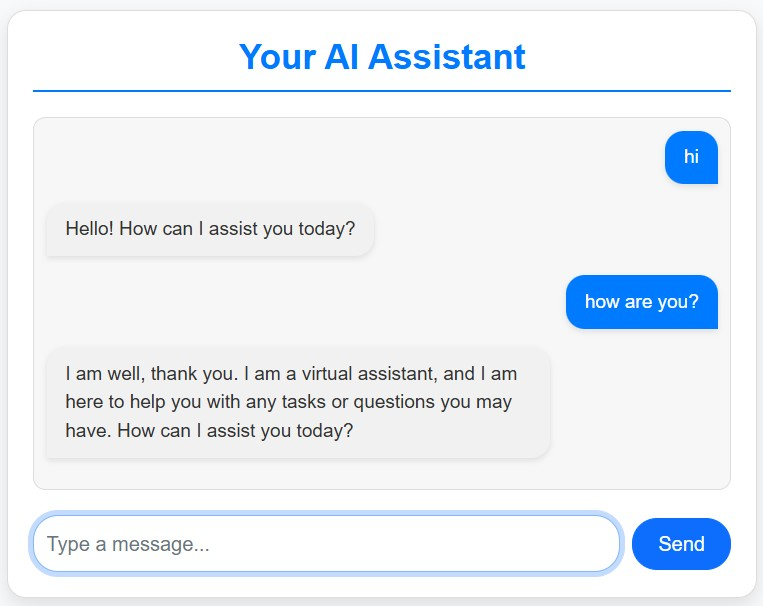

# Your AI Assistant

Your AI Assistant is an interactive chatbot application built with Flask for backend logic and JavaScript for frontend interactivity. Designed with user-friendly features, it enables easy integration and customization for various chatbot use cases.

---

## Objectives

1. **Interactive Design**: Displays user messages on the right and chatbot responses on the left for clear conversation tracking.
2. **Ease of Extension**: Modular design allows developers to easily modify chatbot logic.
3. **Responsive UI**: Mobile and desktop-friendly design using Bootstrap.
4. **Open Source**: Contribute and adapt the project for different purposes.

---

## Features

### 1. User-Friendly Interface
- Clear, interactive chat layout.
- Messages are dynamically styled for readability.

### 2. Backend Customization
- Easily extend chatbot logic in `chatbot_logic.py`.
- Ready for integration with APIs or machine learning models.

### 3. Responsive Design
- Mobile-friendly and adaptable UI using Bootstrap.

---

## Tech Stack

- **Backend**: Flask (Python)
- **Frontend**: HTML, CSS, JavaScript
- **API**: Gemini
- **Styling**: Bootstrap 5

---
**Happy Coding.**

