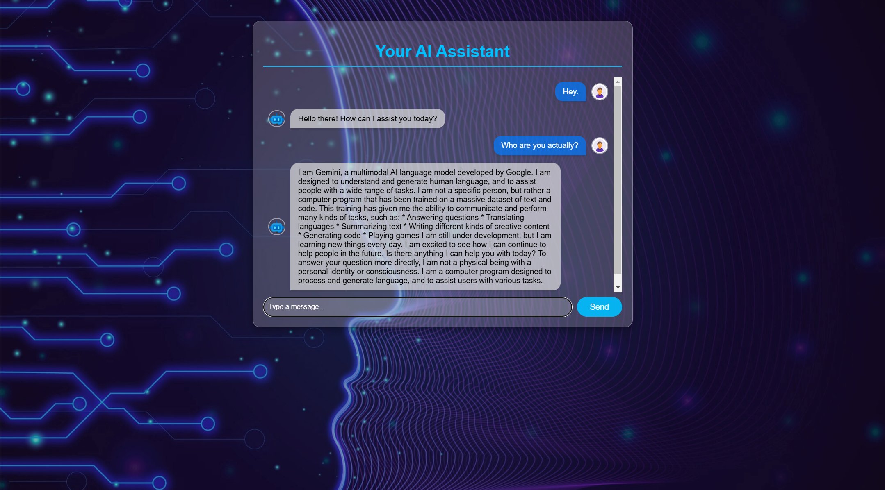

# Your AI Assistant



Your AI Assistant is an interactive chatbot application built with Flask for backend logic and JavaScript for frontend interactivity. Designed with user-friendly features, it enables easy integration and customization for various chatbot use cases.

---

## Objectives

1. **Interactive Design**: Displays user messages on the right and chatbot responses on the left for clear conversation tracking.
2. **Ease of Extension**: Modular design allows developers to easily modify chatbot logic.
3. **Responsive UI**: Mobile and desktop-friendly design.
4. **Open Source**: Contribute and adapt the project for different purposes.

---

## Features

### 1. User-Friendly Interface
- Clear, interactive chat layout.
- Messages are dynamically styled for readability.

### 2. Backend Customization
- Easily extend chatbot logic in `chatbot.py`.
- Ready for integration with APIs or machine learning models.

### 3. Responsive Design
- Mobile-friendly and adaptable UI.

---

## Getting Started

Follow these steps to set up and run Gemini Chatbot on your local machine.

### Prerequisites

- Python 3.8+
- pip (Python package manager)
- Git

## Initial Setup:

This repo currently contains the starter files.

1. Clone the repository & Create a virtual environment (Windows)
```
$ git clone https://github.com/Sayan520/Your-AI-Assistant.git
$ python -m venv venv
$ .\venv\Scripts\activate
```
2. Install the required dependencies
```
$ (venv) pip install -r requirements.txt
```
3. Running the Application
```
$ (venv) python app.py
```

## Tech Stack

- **Backend**: Flask (Python)
- **Frontend**: HTML, CSS, JavaScript
- **API**: Gemini API
---

**Happy Coding.**


